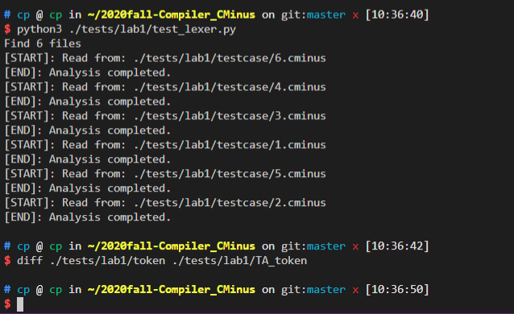

李涛   PB18030972

---

## 实验要求

本次实验需要各位同学根据`cminux-f`的词法补全*lexical_analyer.l*文件，完成词法分析器，能够输出识别出的`token`，`type` ,`line(刚出`

`现的行数)`，`pos_start(该行开始位置)`，`pos_end(结束的位置,不包含)`

## 实验难点

1. flex的模式与动作中注释只能使用`/*……*/,不能使用`//……`。

2. 部分符号在正则表达式中具有特殊含义，如`+、-、*、.`等，匹配这些符号时，需要加转义符号`\`。

3. 一开始没有看懂头文件的意义，是给每个模式分配一个整数，方便使用`switch()`函数。

4. 注释的正则表达式`\/\*([^\*]|(\*)*[^\*/])*(\*)*\*\/` ，`/*……*/`注释格式要求注释内容不能以`*/`为后缀，否则按照最长匹配可能会将两个注释识别成一个。

5. 注释的分析。

   * 首先确定注释占几行(即有几个换行符)，从而确定lines的变化；

     ```c
     for(i = 0;i < strlen(yytext);i++) //注释占据几行
                         {
                             if(yytext[i] == '\n')
                               lines++;
                         }
     ```

     

   * 若注释占据多行且最后一行注释后还有内容则要单独处理       

   ```c
    for(i = strlen(yytext);i >= 0;i--) //注释有多行，最后一行注释占据的位置
                       {
                           if(yytext[i] == '\n')
                             {
                                 pos_start = strlen(yytext) - i;
                                 pos_end = strlen(yytext) - i;
                                 break;
                             }
                       }
   ```

   * 若注释占据一行且注释后还有内容则要单独处理      

     ```c
     if(i<0) //注释只有一行且不在一句的最后，所占据的位置
                         {
                             Change_pos();
                         }
     ```

     

## 实验结果验证

1.助教提供的testcase验证结果



2.增加的testcase

 testcase：

```c
main()/*&testcase&*/{
    empty
}
```

out：

```c
main	285	1	1	5
(	272	1	5	6
)	273	1	6	7
{	276	1	21	22
empty	285	2	5	10
}	277	3	1	2
```


##  实验反馈

**文档很好。**

