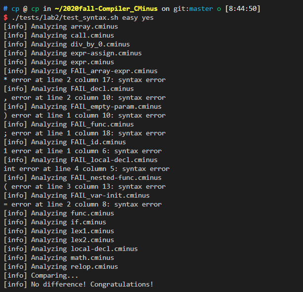
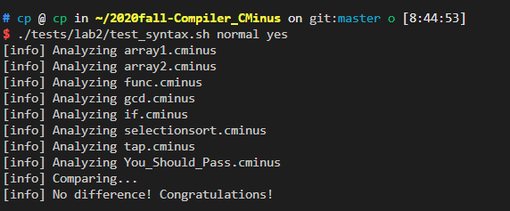

# lab2实验报告

李涛   PB18030972

---

## 实验要求

本次实验需要各位同学首先将自己的 lab1 的词法部分复制到 `/src/parser` 目录的 `lexical `

`\_analyzer.l`并合理修改相应部分，然后根据 `cminus-f` 的语法补全 `syntax\_ analyer.y` 

文件，完成语法分析器，要求最终能够输出解析树。

## 实验设计

* 通过yylval将yytext的值返回到yyparser中

```c
void pass_node(char *text){
     yylval.node = new_syntax_tree_node(text);
}

\+   {Change_pos();pass_node(yytext); return ADD;}
\-   {Change_pos();pass_node(yytext); return SUB;}
\*   {Change_pos();pass_node(yytext); return MUL;}
\/   {Change_pos();pass_node(yytext); return DIV;}
\<   {Change_pos();pass_node(yytext); return LT;}
\<=  {Change_pos();pass_node(yytext); return LTE;}
\>   {Change_pos();pass_node(yytext); return GT;}
\>=  {Change_pos();pass_node(yytext); return GTE;}
\==  {Change_pos();pass_node(yytext); return EQ;}
\!=  {Change_pos();pass_node(yytext); return NEQ;}
\=   {Change_pos();pass_node(yytext); return ASSIN;}
    /*符号*/
;   {Change_pos();pass_node(yytext); return SEMICOLON;}
,   {Change_pos();pass_node(yytext); return COMMA;}
\(   {Change_pos();pass_node(yytext); return LPARENTHESE;}
\)   {Change_pos();pass_node(yytext); return RPARENTHESE;}
\[   {Change_pos();pass_node(yytext); return  LBRACKET;}
\]   {Change_pos();pass_node(yytext); return  RBRACKET;}
\{   {Change_pos();pass_node(yytext); return  LBRACE ;}
\}   {Change_pos();pass_node(yytext); return  RBRACE ;}
     /*关键字*/
else {Change_pos();pass_node(yytext); return  ELSE;}
if   {Change_pos();pass_node(yytext); return  IF;}
int  {Change_pos();pass_node(yytext); return  INT;}
float {Change_pos();pass_node(yytext); return FLOAT;}
return {Change_pos();pass_node(yytext); return RETURN;}
void {Change_pos();pass_node(yytext); return VOID;}
while {Change_pos();pass_node(yytext); return WHILE;}
    /*ID和NUM，字母在标识符之后*/
[a-zA-Z]+  {Change_pos();pass_node(yytext); return IDENTIFIER;}
[0-9]+     {Change_pos();pass_node(yytext); return  INTEGER;}
[0-9]+\.|[0-9]*\.[0-9]+  {Change_pos();pass_node(yytext); return  FLOATPOINT;}
\[\] {Change_pos();pass_node(yytext); return  ARRAY;}
    /*其他*/
\/\*([^\*]|(\*)*[^\*/])*(\*)*\*\/  {analyzer(COMMENT);}
[ \t]  {analyzer(BLANK);}    
\n {analyzer(EOL);}
. {analyzer(ERROR);}

%%
 /****************C代码 start*************/

void analyzer(int token){
   
    int i;   
        switch(token){
            case COMMENT:
                {
                    for(i = 0;i<strlen(yytext);i++) //注释占据几行
                    {
                        if(yytext[i] == '\n')
                          lines++;
                    }
                    for(i = strlen(yytext);i>=0;i--) //注释有多行，最后一行注释占据的位置
                    {
                        if(yytext[i] == '\n')
                          {
                              pos_start = strlen(yytext) - i;
                              pos_end = strlen(yytext) - i;
                              break;
                          }
                    }
                    if(i<0) //注释只有一行且不在一句的最后，所占据的位置
                    {
                        Change_pos();
                    }
                }
                break;
            case BLANK:
                {
                    pos_start = pos_end;     //空格和\t位置只加一
                    pos_end = pos_start + 1;       
                }
                break;
            case EOL:
                    {
                        lines++;
                        pos_end = 1;
                        pos_start = 1;
                    }
                break;
            case ERROR:
                printf("[ERR]: unable to analysize %s at %d line, from %d to %d\n", yytext, lines, pos_start, pos_end);
            default :
                break; 
        }
     return;
}
```

* 完成tokens和规则

```c
/* TODO: Complete this definition. */
%union {
    syntax_tree_node* node;
}

/* TODO: Your tokens here. */
%token <node> ADD SUB MUL DIV LT LTE GT GTE EQ NEQ ASSIN SEMICOLON COMMA LPARENTHESE RPARENTHESE LBRACKET 
              RBRACKET LBRACE RBRACE ELSE IF INT FLOAT RETURN VOID WHILE IDENTIFIER INTEGER FLOATPOINT ARRAY LETTER COMMENT BLANK EOL ERROR 
%type <node> program type-specifier relop addop mulop declaration-list declaration var-declaration fun-declaration local-declarations compound-stmt statement-list statement expression-stmt iteration-stmt
             selection-stmt return-stmt expression simple-expression var additive-expression term factor integer float call params param-list param args arg-list

%start program

%%
/* TODO: Your rules here. */

program : declaration-list { $$ = node("program", 1, $1); gt->root = $$; }
declaration-list : declaration-list declaration { $$ = node("declaration-list",2, $1, $2 ); }
                 | declaration { $$ = node("declaration-list",1, $1); }
declaration : var-declaration { $$ = node("declaration",1, $1); }
            | fun-declaration { $$ = node("declaration",1, $1); }
var-declaration : type-specifier IDENTIFIER SEMICOLON { $$ = node("var-declaration",3, $1, $2, $3); }
                | type-specifier IDENTIFIER LBRACKET INTEGER RBRACKET SEMICOLON { $$ = node("var-declaration",6, $1, $2, $3, $4, $5, $6); }
type-specifier : INT { $$ = node("type-specifier",1, $1); }
               | FLOAT { $$ = node("type-specifier",1, $1); } 
               | VOID { $$ = node("type-specifier",1, $1); }
fun-declaration : type-specifier IDENTIFIER LPARENTHESE params RPARENTHESE compound-stmt { $$ = node("fun-declaration",6, $1, $2, $3, $4, $5, $6); }
params : param-list { $$ = node("params",1, $1); }    
       | VOID { $$ = node("params",1, $1); }          
param-list : param-list COMMA param { $$ = node("param-list",3, $1, $2, $3); }
           | param { $$ = node("param-list",1, $1); } 
param : type-specifier IDENTIFIER { $$ = node("param",2, $1, $2 ); }
      | type-specifier IDENTIFIER ARRAY { $$ = node("param",3, $1, $2, $3); }
compound-stmt : LBRACE local-declarations statement-list RBRACE { $$ = node("compound-stmt",4, $1, $2, $3, $4); }
local-declarations : local-declarations var-declaration { $$ = node("local-declarations",2, $1, $2 ); }
                   | { $$ = node("local-declarations", 0); }
statement-list : statement-list statement { $$ = node("statement-list",2, $1, $2 ); }
               | { $$ = node("statement-list", 0); }
statement : expression-stmt { $$ = node("statement",1, $1); } 
          | compound-stmt { $$ = node("statement",1, $1); } 
          | selection-stmt { $$ = node("statement",1, $1); } 
          | iteration-stmt { $$ = node("statement",1, $1); } 
          | return-stmt { $$ = node("statement",1, $1); } 
expression-stmt : expression SEMICOLON { $$ = node("expression-stmt",2, $1, $2 ); }
                | SEMICOLON { $$ = node("expression-stmt",1, $1); } 
selection-stmt : IF LPARENTHESE expression RPARENTHESE statement { $$ = node("selection-stmt",5, $1, $2, $3, $4, $5); }
               | IF LPARENTHESE expression RPARENTHESE statement ELSE statement { $$ = node("selection-stmt",7, $1, $2, $3, $4, $5, $6, $7); }
iteration-stmt : WHILE LPARENTHESE expression RPARENTHESE statement { $$ = node("iteration-stmt",5, $1, $2, $3, $4, $5); }
return-stmt : RETURN SEMICOLON { $$ = node("return-stmt",2, $1, $2 ); }
            | RETURN expression SEMICOLON { $$ = node("return-stmt", 3, $1, $2, $3); }
expression : var ASSIN expression { $$ = node("expression", 3, $1, $2, $3); }
           | simple-expression { $$ = node("expression", 1, $1); } 
var : IDENTIFIER { $$ = node("var",1, $1); } 
    | IDENTIFIER LBRACKET expression RBRACKET { $$ = node("var", 4, $1, $2, $3, $4); }
simple-expression : additive-expression relop additive-expression { $$ = node("simple-expression", 3, $1, $2, $3); }
                  | additive-expression { $$ = node("simple-expression",1, $1); } 
relop : LTE { $$ = node("relop",1, $1); } 
      | LT { $$ = node("relop",1, $1); } 
      | GT { $$ = node("relop",1, $1); } 
      | GTE { $$ = node("relop",1, $1); } 
      | EQ { $$ = node("relop",1, $1); } 
      | NEQ { $$ = node("relop",1, $1); } 
additive-expression : additive-expression addop term { $$ = node("additive-expression", 3, $1, $2, $3); }
                    | term  { $$ = node("additive-expression",1, $1); }             
addop : ADD { $$ = node("addop",1, $1); } 
      | SUB { $$ = node("addop",1, $1); } 
term : term mulop factor { $$ = node("term", 3, $1, $2, $3); }
     | factor { $$ = node("term",1, $1); } 
mulop : MUL { $$ = node("mulop",1, $1); } 
      | DIV { $$ = node("mulop",1, $1); }
factor : LPARENTHESE expression RPARENTHESE { $$ = node("factor", 3, $1, $2, $3); }
       | var { $$ = node("factor",1, $1); }
       | call { $$ = node("factor",1, $1); }
       | integer { $$ = node("factor",1, $1); }
       | float { $$ = node("factor",1, $1); }
integer : INTEGER { $$ = node("integer",1, $1); }
float : FLOATPOINT { $$ = node("float",1, $1); }
call : IDENTIFIER LPARENTHESE args RPARENTHESE { $$ = node("call", 4, $1, $2, $3, $4); }
args : arg-list { $$ = node("args",1, $1); }
     | { $$ = node("args", 0); }
arg-list : arg-list COMMA expression { $$ = node("arg-list", 3, $1, $2, $3); }
         | expression { $$ = node("arg-list",1, $1); }
```


## 实验难点

1. 理解分析树是如何生成的。

2. 如何将文法产生式转换为`bison`语句，因为产生式有很多，所以写的时候要仔细否则检查的时候很麻烦。

3. 了解`bison`和`flex`之间如何协同工作。

4. `/* 这种写法表示 ε —— 空输入 */`
   `marisa : { puts("Hello!"); }`

   不用增加一个终结符empty，那样会报错。

5. `lexical\_analyzer.l`中不能有main函数，否则会有冲突。

## 实验结果验证

1.助教提供的testcase验证结果

* easy case



* normal case

  ​                                       

2.增加的testcase

 testcase：

```c
int main(void)
{
    int s[3];
    a = 2.;
    while(a!=.6){
        aa = 1;
    }
    if(cd == 1){
        if(m <= 5)
           gao = 777;
        else if(p == 1)
             litao = 999;
    }
}
```

out：

```c
>--+ program
|  >--+ declaration-list
|  |  >--+ declaration
|  |  |  >--+ fun-declaration
|  |  |  |  >--+ type-specifier
|  |  |  |  |  >--* int
|  |  |  |  >--* main
|  |  |  |  >--* (
|  |  |  |  >--+ params
|  |  |  |  |  >--* void
|  |  |  |  >--* )
|  |  |  |  >--+ compound-stmt
|  |  |  |  |  >--* {
|  |  |  |  |  >--+ local-declarations
|  |  |  |  |  |  >--+ local-declarations
|  |  |  |  |  |  |  >--* epsilon
|  |  |  |  |  |  >--+ var-declaration
|  |  |  |  |  |  |  >--+ type-specifier
|  |  |  |  |  |  |  |  >--* int
|  |  |  |  |  |  |  >--* s
|  |  |  |  |  |  |  >--* [
|  |  |  |  |  |  |  >--* 3
|  |  |  |  |  |  |  >--* ]
|  |  |  |  |  |  |  >--* ;
|  |  |  |  |  >--+ statement-list
|  |  |  |  |  |  >--+ statement-list
|  |  |  |  |  |  |  >--+ statement-list
|  |  |  |  |  |  |  |  >--+ statement-list
|  |  |  |  |  |  |  |  |  >--* epsilon
|  |  |  |  |  |  |  |  >--+ statement
|  |  |  |  |  |  |  |  |  >--+ expression-stmt
|  |  |  |  |  |  |  |  |  |  >--+ expression
|  |  |  |  |  |  |  |  |  |  |  >--+ var
|  |  |  |  |  |  |  |  |  |  |  |  >--* a
|  |  |  |  |  |  |  |  |  |  |  >--* =
|  |  |  |  |  |  |  |  |  |  |  >--+ expression
|  |  |  |  |  |  |  |  |  |  |  |  >--+ simple-expression
|  |  |  |  |  |  |  |  |  |  |  |  |  >--+ additive-expression
|  |  |  |  |  |  |  |  |  |  |  |  |  |  >--+ term
|  |  |  |  |  |  |  |  |  |  |  |  |  |  |  >--+ factor
|  |  |  |  |  |  |  |  |  |  |  |  |  |  |  |  >--+ float
|  |  |  |  |  |  |  |  |  |  |  |  |  |  |  |  |  >--* 2.
|  |  |  |  |  |  |  |  |  |  >--* ;
|  |  |  |  |  |  |  >--+ statement
|  |  |  |  |  |  |  |  >--+ iteration-stmt
|  |  |  |  |  |  |  |  |  >--* while
|  |  |  |  |  |  |  |  |  >--* (
|  |  |  |  |  |  |  |  |  >--+ expression
|  |  |  |  |  |  |  |  |  |  >--+ simple-expression
|  |  |  |  |  |  |  |  |  |  |  >--+ additive-expression
|  |  |  |  |  |  |  |  |  |  |  |  >--+ term
|  |  |  |  |  |  |  |  |  |  |  |  |  >--+ factor
|  |  |  |  |  |  |  |  |  |  |  |  |  |  >--+ var
|  |  |  |  |  |  |  |  |  |  |  |  |  |  |  >--* a
|  |  |  |  |  |  |  |  |  |  |  >--+ relop
|  |  |  |  |  |  |  |  |  |  |  |  >--* !=
|  |  |  |  |  |  |  |  |  |  |  >--+ additive-expression
|  |  |  |  |  |  |  |  |  |  |  |  >--+ term
|  |  |  |  |  |  |  |  |  |  |  |  |  >--+ factor
|  |  |  |  |  |  |  |  |  |  |  |  |  |  >--+ float
|  |  |  |  |  |  |  |  |  |  |  |  |  |  |  >--* .6
|  |  |  |  |  |  |  |  |  >--* )
|  |  |  |  |  |  |  |  |  >--+ statement
|  |  |  |  |  |  |  |  |  |  >--+ compound-stmt
|  |  |  |  |  |  |  |  |  |  |  >--* {
|  |  |  |  |  |  |  |  |  |  |  >--+ local-declarations
|  |  |  |  |  |  |  |  |  |  |  |  >--* epsilon
|  |  |  |  |  |  |  |  |  |  |  >--+ statement-list
|  |  |  |  |  |  |  |  |  |  |  |  >--+ statement-list
|  |  |  |  |  |  |  |  |  |  |  |  |  >--* epsilon
|  |  |  |  |  |  |  |  |  |  |  |  >--+ statement
|  |  |  |  |  |  |  |  |  |  |  |  |  >--+ expression-stmt
|  |  |  |  |  |  |  |  |  |  |  |  |  |  >--+ expression
|  |  |  |  |  |  |  |  |  |  |  |  |  |  |  >--+ var
|  |  |  |  |  |  |  |  |  |  |  |  |  |  |  |  >--* aa
|  |  |  |  |  |  |  |  |  |  |  |  |  |  |  >--* =
|  |  |  |  |  |  |  |  |  |  |  |  |  |  |  >--+ expression
|  |  |  |  |  |  |  |  |  |  |  |  |  |  |  |  >--+ simple-expression
|  |  |  |  |  |  |  |  |  |  |  |  |  |  |  |  |  >--+ additive-expression
|  |  |  |  |  |  |  |  |  |  |  |  |  |  |  |  |  |  >--+ term
|  |  |  |  |  |  |  |  |  |  |  |  |  |  |  |  |  |  |  >--+ factor
|  |  |  |  |  |  |  |  |  |  |  |  |  |  |  |  |  |  |  |  >--+ integer
|  |  |  |  |  |  |  |  |  |  |  |  |  |  |  |  |  |  |  |  |  >--* 1
|  |  |  |  |  |  |  |  |  |  |  |  |  |  >--* ;
|  |  |  |  |  |  |  |  |  |  |  >--* }
|  |  |  |  |  |  >--+ statement
|  |  |  |  |  |  |  >--+ selection-stmt
|  |  |  |  |  |  |  |  >--* if
|  |  |  |  |  |  |  |  >--* (
|  |  |  |  |  |  |  |  >--+ expression
|  |  |  |  |  |  |  |  |  >--+ simple-expression
|  |  |  |  |  |  |  |  |  |  >--+ additive-expression
|  |  |  |  |  |  |  |  |  |  |  >--+ term
|  |  |  |  |  |  |  |  |  |  |  |  >--+ factor
|  |  |  |  |  |  |  |  |  |  |  |  |  >--+ var
|  |  |  |  |  |  |  |  |  |  |  |  |  |  >--* cd
|  |  |  |  |  |  |  |  |  |  >--+ relop
|  |  |  |  |  |  |  |  |  |  |  >--* ==
|  |  |  |  |  |  |  |  |  |  >--+ additive-expression
|  |  |  |  |  |  |  |  |  |  |  >--+ term
|  |  |  |  |  |  |  |  |  |  |  |  >--+ factor
|  |  |  |  |  |  |  |  |  |  |  |  |  >--+ integer
|  |  |  |  |  |  |  |  |  |  |  |  |  |  >--* 1
|  |  |  |  |  |  |  |  >--* )
|  |  |  |  |  |  |  |  >--+ statement
|  |  |  |  |  |  |  |  |  >--+ compound-stmt
|  |  |  |  |  |  |  |  |  |  >--* {
|  |  |  |  |  |  |  |  |  |  >--+ local-declarations
|  |  |  |  |  |  |  |  |  |  |  >--* epsilon
|  |  |  |  |  |  |  |  |  |  >--+ statement-list
|  |  |  |  |  |  |  |  |  |  |  >--+ statement-list
|  |  |  |  |  |  |  |  |  |  |  |  >--* epsilon
|  |  |  |  |  |  |  |  |  |  |  >--+ statement
|  |  |  |  |  |  |  |  |  |  |  |  >--+ selection-stmt
|  |  |  |  |  |  |  |  |  |  |  |  |  >--* if
|  |  |  |  |  |  |  |  |  |  |  |  |  >--* (
|  |  |  |  |  |  |  |  |  |  |  |  |  >--+ expression
|  |  |  |  |  |  |  |  |  |  |  |  |  |  >--+ simple-expression
|  |  |  |  |  |  |  |  |  |  |  |  |  |  |  >--+ additive-expression
|  |  |  |  |  |  |  |  |  |  |  |  |  |  |  |  >--+ term
|  |  |  |  |  |  |  |  |  |  |  |  |  |  |  |  |  >--+ factor
|  |  |  |  |  |  |  |  |  |  |  |  |  |  |  |  |  |  >--+ var
|  |  |  |  |  |  |  |  |  |  |  |  |  |  |  |  |  |  |  >--* m
|  |  |  |  |  |  |  |  |  |  |  |  |  |  |  >--+ relop
|  |  |  |  |  |  |  |  |  |  |  |  |  |  |  |  >--* <=
|  |  |  |  |  |  |  |  |  |  |  |  |  |  |  >--+ additive-expression
|  |  |  |  |  |  |  |  |  |  |  |  |  |  |  |  >--+ term
|  |  |  |  |  |  |  |  |  |  |  |  |  |  |  |  |  >--+ factor
|  |  |  |  |  |  |  |  |  |  |  |  |  |  |  |  |  |  >--+ integer
|  |  |  |  |  |  |  |  |  |  |  |  |  |  |  |  |  |  |  >--* 5
|  |  |  |  |  |  |  |  |  |  |  |  |  >--* )
|  |  |  |  |  |  |  |  |  |  |  |  |  >--+ statement
|  |  |  |  |  |  |  |  |  |  |  |  |  |  >--+ expression-stmt
|  |  |  |  |  |  |  |  |  |  |  |  |  |  |  >--+ expression
|  |  |  |  |  |  |  |  |  |  |  |  |  |  |  |  >--+ var
|  |  |  |  |  |  |  |  |  |  |  |  |  |  |  |  |  >--* gao
|  |  |  |  |  |  |  |  |  |  |  |  |  |  |  |  >--* =
|  |  |  |  |  |  |  |  |  |  |  |  |  |  |  |  >--+ expression
|  |  |  |  |  |  |  |  |  |  |  |  |  |  |  |  |  >--+ simple-expression
|  |  |  |  |  |  |  |  |  |  |  |  |  |  |  |  |  |  >--+ additive-expression
|  |  |  |  |  |  |  |  |  |  |  |  |  |  |  |  |  |  |  >--+ term
|  |  |  |  |  |  |  |  |  |  |  |  |  |  |  |  |  |  |  |  >--+ factor
|  |  |  |  |  |  |  |  |  |  |  |  |  |  |  |  |  |  |  |  |  >--+ integer
|  |  |  |  |  |  |  |  |  |  |  |  |  |  |  |  |  |  |  |  |  |  >--* 777
|  |  |  |  |  |  |  |  |  |  |  |  |  |  |  >--* ;
|  |  |  |  |  |  |  |  |  |  |  |  |  >--* else
|  |  |  |  |  |  |  |  |  |  |  |  |  >--+ statement
|  |  |  |  |  |  |  |  |  |  |  |  |  |  >--+ selection-stmt
|  |  |  |  |  |  |  |  |  |  |  |  |  |  |  >--* if
|  |  |  |  |  |  |  |  |  |  |  |  |  |  |  >--* (
|  |  |  |  |  |  |  |  |  |  |  |  |  |  |  >--+ expression
|  |  |  |  |  |  |  |  |  |  |  |  |  |  |  |  >--+ simple-expression
|  |  |  |  |  |  |  |  |  |  |  |  |  |  |  |  |  >--+ additive-expression
|  |  |  |  |  |  |  |  |  |  |  |  |  |  |  |  |  |  >--+ term
|  |  |  |  |  |  |  |  |  |  |  |  |  |  |  |  |  |  |  >--+ factor
|  |  |  |  |  |  |  |  |  |  |  |  |  |  |  |  |  |  |  |  >--+ var
|  |  |  |  |  |  |  |  |  |  |  |  |  |  |  |  |  |  |  |  |  >--* p
|  |  |  |  |  |  |  |  |  |  |  |  |  |  |  |  |  >--+ relop
|  |  |  |  |  |  |  |  |  |  |  |  |  |  |  |  |  |  >--* ==
|  |  |  |  |  |  |  |  |  |  |  |  |  |  |  |  |  >--+ additive-expression
|  |  |  |  |  |  |  |  |  |  |  |  |  |  |  |  |  |  >--+ term
|  |  |  |  |  |  |  |  |  |  |  |  |  |  |  |  |  |  |  >--+ factor
|  |  |  |  |  |  |  |  |  |  |  |  |  |  |  |  |  |  |  |  >--+ integer
|  |  |  |  |  |  |  |  |  |  |  |  |  |  |  |  |  |  |  |  |  >--* 1
|  |  |  |  |  |  |  |  |  |  |  |  |  |  |  >--* )
|  |  |  |  |  |  |  |  |  |  |  |  |  |  |  >--+ statement
|  |  |  |  |  |  |  |  |  |  |  |  |  |  |  |  >--+ expression-stmt
|  |  |  |  |  |  |  |  |  |  |  |  |  |  |  |  |  >--+ expression
|  |  |  |  |  |  |  |  |  |  |  |  |  |  |  |  |  |  >--+ var
|  |  |  |  |  |  |  |  |  |  |  |  |  |  |  |  |  |  |  >--* litao
|  |  |  |  |  |  |  |  |  |  |  |  |  |  |  |  |  |  >--* =
|  |  |  |  |  |  |  |  |  |  |  |  |  |  |  |  |  |  >--+ expression
|  |  |  |  |  |  |  |  |  |  |  |  |  |  |  |  |  |  |  >--+ simple-expression
|  |  |  |  |  |  |  |  |  |  |  |  |  |  |  |  |  |  |  |  >--+ additive-expression
|  |  |  |  |  |  |  |  |  |  |  |  |  |  |  |  |  |  |  |  |  >--+ term
|  |  |  |  |  |  |  |  |  |  |  |  |  |  |  |  |  |  |  |  |  |  >--+ factor
|  |  |  |  |  |  |  |  |  |  |  |  |  |  |  |  |  |  |  |  |  |  |  >--+ integer
|  |  |  |  |  |  |  |  |  |  |  |  |  |  |  |  |  |  |  |  |  |  |  |  >--* 999
|  |  |  |  |  |  |  |  |  |  |  |  |  |  |  |  |  >--* ;
|  |  |  |  |  |  |  |  |  |  >--* }
|  |  |  |  |  >--* }

```


##  实验反馈

**文档很好。**

